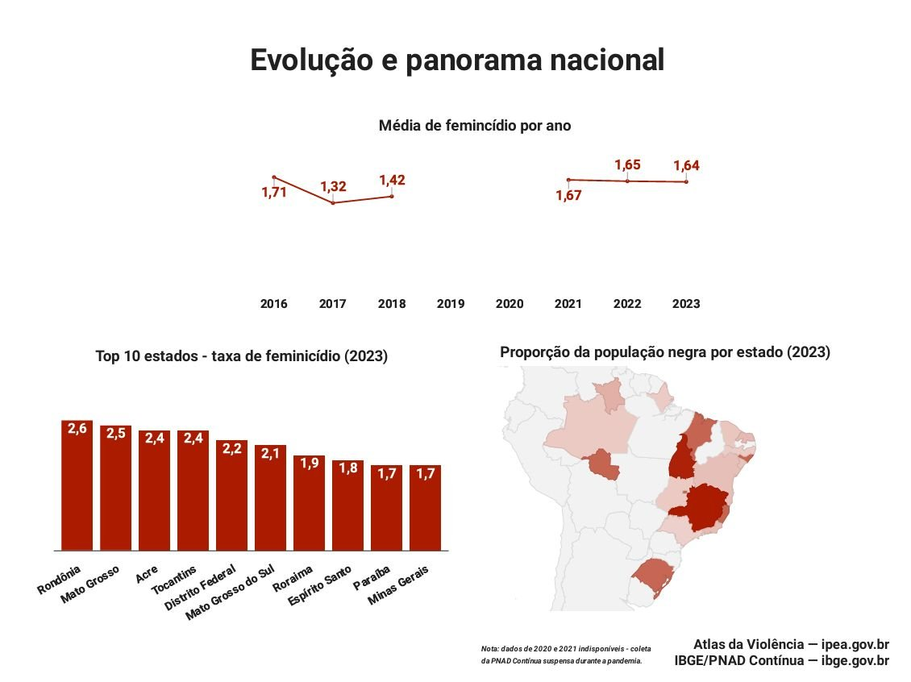
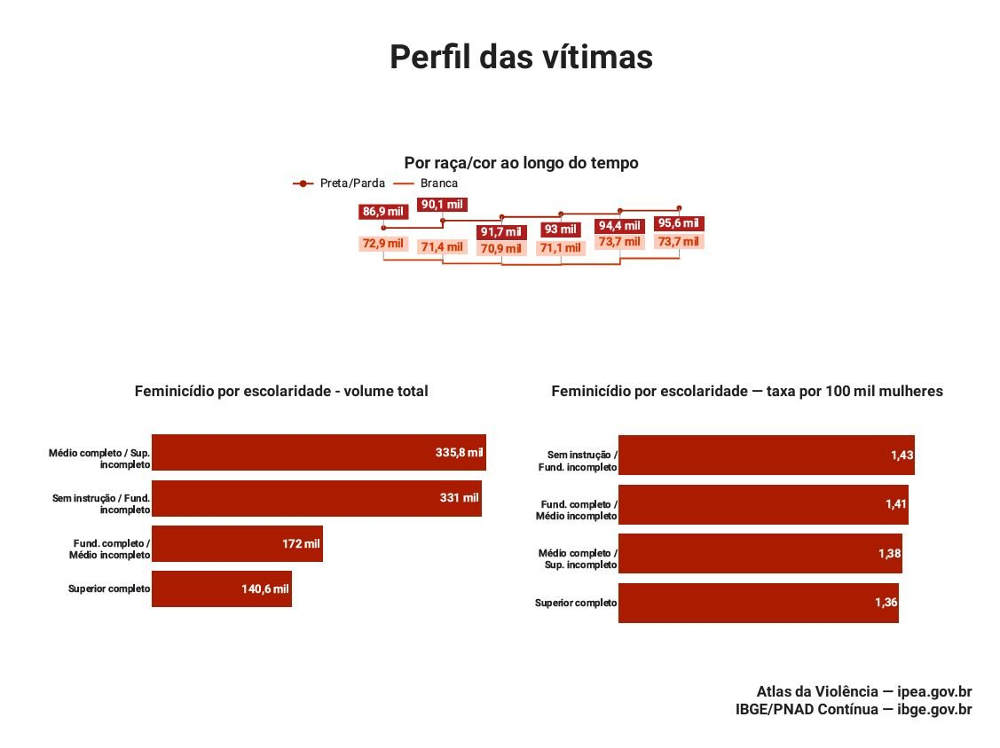

# Análise de Feminicídio no Brasil — Python + SQL

## Sobre o projeto

Projeto de análise de dados sobre feminicídio e violência contra mulheres no Brasil.
Cruza dados do IBGE (raça, escolaridade, população) com dados do SIM/DATASUS (óbitos)
e da PNS (Pesquisa Nacional de Saúde) para entender o perfil das vítimas e as tendências ao longo dos anos.

Este é um dos projetos mais completos do portfólio: vai da coleta e limpeza dos dados até a geração de análises temáticas exportadas em Excel.

---

## Resultados

### Evolução e panorama nacional


> A taxa média de feminicídio caiu de **1,71** (2016) para **1,32** (2017), voltou a subir e se estabilizou em torno de **1,64–1,67** entre 2020 e 2023. Rondônia lidera o ranking estadual em 2023 com taxa de **2,6 por 100 mil mulheres**.

---

### Perfil das vítimas


> Mulheres pretas e pardas são consistentemente mais vitimadas ao longo de todos os anos analisados. Em relação à escolaridade, a taxa por 100 mil mulheres é inversamente proporcional ao nível de instrução — mulheres sem instrução ou com fundamental incompleto têm a maior taxa (1,43).

---

## Dashboard interativo

🔗 [Acesse o dashboard no Looker Studio](https://datastudio.google.com/s/pRaeiSEm9p8)

---

## Ferramentas
- Python (pandas, numpy)
- SQL (MySQL)
- Excel (outputs das análises)

## Análises realizadas

| Script | Análise |
|--------|---------|
| `01_evolucao_nacional.py` | Evolução da taxa de feminicídio no Brasil ao longo dos anos |
| `02_taxa_por_estado_ano.py` | Taxa por estado e ano — ranking e variações |
| `03_populacao_por_raca_ano.py` | Distribuição da população feminina por raça/cor e ano |
| `04_populacao_por_instrucao_ano.py` | Distribuição por nível de instrução e ano |
| `05_feminicidio_x_raca.py` | Cruzamento: taxa de feminicídio × raça/cor |
| `06_feminicidio_x_instrucao.py` | Cruzamento: taxa de feminicídio × escolaridade |
| `07_raca_nivel_instrucao.py` | Tratamento e reshape do CSV de raça + instrução (IBGE) |
| `08_analise.sql` | Consultas complementares no MySQL |

## Estrutura

```
02_analise_feminicidio/
├── assets/                         → imagens e gráficos dos resultados
│   ├── grafico_evolucao_panorama_nacional.png
│   └── grafico_perfil_vitimas.png
├── data/
│   ├── raw/                        → arquivos originais baixados das fontes
│   │   ├── feminicidio_serie_historica.csv   (SIM/DATASUS)
│   │   ├── raca_nivel_instrucao.csv          (IBGE)
│   │   ├── taxa_ameaca_vitimas_mulheres.csv  (Indicador 10.5)
│   │   ├── pns_violencia_fem_2013.csv        (PNS 2013)
│   │   ├── pns_violencia_fem_2019.csv        (PNS 2019)
│   │   └── geo_macroregiao.csv
│   └── processed/                  → dados limpos e prontos para análise
│       ├── dado_ibge_limpo.csv
│       ├── taxa_ameaca_vit_mulheres_tratada.csv
│       └── perc_raca.csv
├── scripts/                        → scripts Python e SQL em ordem de execução
├── outputs/                        → resultados das análises (Excel + CSV)
│   ├── 01_evolucao_nacional.xlsx
│   ├── 02_taxa_por_estado_ano.xlsx
│   ├── 03_populacao_por_raca_ano.xlsx
│   ├── 04_populacao_por_instrucao_ano.xlsx
│   ├── 05_feminicidio_x_raca.xlsx
│   ├── 06_feminicidio_x_instrucao.xlsx
│   └── 07_top10_estados_2023.csv
└── exploracao/                     → rascunhos e scripts de exploração inicial
```

## Aprendizados

- Limpeza e tratamento de CSVs complexos (cabeçalhos sujos, separadores variados, encoding)
- Uso de `melt()` para transformar tabelas wide → long (reshape de dados)
- Cruzamento de múltiplas fontes com `merge()`
- Cálculo de percentuais e agrupamentos com `groupby()`
- Tratamento de datas e cálculo de idade com pandas

## Fontes dos dados

- DATASUS / SIM — Sistema de Informações sobre Mortalidade
- IBGE — Pesquisa Nacional por Amostra de Domicílios (PNAD)
- Pesquisa Nacional de Saúde (PNS) 2013 e 2019
- [Atlas da Violência — ipea.gov.br](https://ipea.gov.br)
- [IBGE/PNAD Contínua — ibge.gov.br](https://ibge.gov.br)
